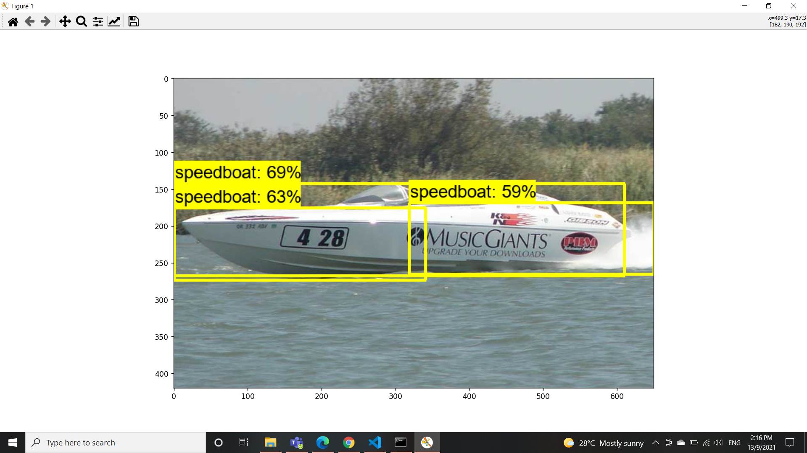

# A.  Environment Setup (Tested)

| Requirement | Version/Description |
| ---------- | ---------- |
| Operating System | Windows 10 / Ubuntu 20.04 |
| IDE (Compiler) | Microsoft Visual Studio 2019 (MSVC 2019) / GCC 7.3.1 |
| CUDA-enabled GPU | NVIDIA GeForce GTX 1060 |
| NVIDIA® GPU drivers | Version 471.96 (as of September 8th, 2021) |
| CUDA® Toolkit | CUDA® 11.2.0 (Dec 2020) |
| cuDNN SDK | 8.1.0 (January 26th, 2021) for CUDA 11.0, 11.1 and 11.2 |
| Python | 3.9.7 (as of September 8th, 2021) |
| Tensorflow **(install in step 4)** | 2.6.0 (as of September 8th, 2021) |
| Tensorflow-gpu **(install in step 4)** | 2.6.0 (as of September 8th, 2021) |
| Protocol Buffers | [3.17.3](https://github.com/protocolbuffers/protobuf/releases/tag/v3.17.3) (Jun 2021) |

# B.  Steps

## Step 1 : Clone this repository into your machine using terminal.

`git clone https://github.com/serpentuin/ship-detection-using-tensorflow.git`

## Step 2 : Create Python virtual environment and activate it using terminal.

`cd ship-detection-using-tensorflow`

`python -m venv env`

`source env/bin/activate`
for **Unix/Ubuntu**

`.\env\Scripts\activate`
for **Windows**

## Step 3 : Update pip version to the latest.

`python -m pip install upgrade pip`

## Step 4 : Install the required libraries.

`pip install -r requirements.txt`

## Step 5 : Create folders using `create_folder.py` script.

```
'CUSTOM_MODEL_NAME' : 'ship_mobnet', 
'PRETRAINED_MODEL_NAME' : 'ssd_mobilenet_v2_fpnlite_320x320_coco17_tpu-8',
'PRETRAINED_MODEL_URL' : 'http://download.tensorflow.org/models/object_detection/tf2/20200711/ssd_mobilenet_v2_fpnlite_320x320_coco17_tpu-8.tar.gz',
'TF_RECORD_SCRIPT_NAME' : 'generate_tfrecord.py',
'LABEL_MAP_NAME' : 'label_map.pbtxt',

```

Above codes are the snippets from a part of codes in `create_folder.py`script. Please select a pre-trained object-detection model from [Tensorflow Hub](https://tfhub.dev/s?module-type=image-object-detection&tf-version=tf2) and be sure to change the following variables accordingly:

```
CUSTOM_MODEL_NAME = 
PRETRAINED_MODEL_NAME = 
PRETRAINED_MODEL_URL = 
```

Open the terminal, and run the following command to create the necessary folders:

`python create_folder.py`

## Step 6 : Install annotation tool (labelImg).

### Unix/Ubuntu

`git clone https://github.com/tzutalin/labelImg.git`

`make qt5py3`

### Windows

`git clone https://github.com/tzutalin/labelImg.git`

`pyrcc5 -o labelImg\libs\resources.py resources.qrc`

## Step 7 : Annotate the images using labelImg.

Store all images in `ship-detection-using-tensorflow\Tensorflow\workspace\images` directory.
Type following command in terminal to open the annotation tool (labelImg).

`cd labelImg`

`python labelImg.py`

Annotate all images until finish in the appropriate format. Refer to the following table for the format convention.

| Format |  File Type |
|--------|------------|
| Pascal VOC  | .xml  |
| YOLO  | .txt  |

After all images have been annotated. Split the images into two different category; **Train** and **Test**.

You may divide it according to 85% : 25% ratio. Insert the images into the folder **Train** and **Test** accordingly.

## Step 8 : Install Protocol Buffer (Protobuf).

### Unix/Ubuntu

Using terminal, type the following command to install Protocol Buffer on Unix Operating System.

`sudo apt-get install protobuf-compiler`

### Windows

Using terminal, type the following command to install Protocol Buffer on Windows Operating System.

`python install_protobuf_for_windows.py`

Using terminal, add the Protocol Buffer's installation directories to the `%PATH%` environmental variable. [Click Here](https://helpdeskgeek.com/windows-10/add-windows-path-environment-variable/) for more tutorials.

`SET PATH=D:\ship-detection-using-tensorflow\Tensorflow\protoc\bin;%PATH%`

## Step 9 : Download Tensorflow Object Detection API.

Run the `download_tfod_api.py` script using the following command to download the Tensorflow object detection API.

`python download_tfod_api.py`

## Step 10 : Install Tensorflow Object Detection API.

### Unix/Ubuntu

Type the following command in the terminal to install the Tensorflow Object Detection API on Unix Operating System.

`cd Tensorflow/models/research && protoc object_detection/protos/*.proto --python_out=. && cp object_detection/packages/tf2/setup.py . && python -m pip install . `

### Windows

Type the following command in the terminal to install the Tensorflow Object Detection API on Windows Operating System.

`cd Tensorflow/models/research && protoc object_detection/protos/*.proto --python_out=. && copy object_detection\\packages\\tf2\\setup.py setup.py && python setup.py build && python setup.py install`

`cd Tensorflow/models/research/slim && pip install -e . `

## Step 11 : Download the pretrained model.

Using the terminal, run the `download_pretrained_model.py` script to download the pretrained model:

`python download_pretrained_model.py`

# C.  Pretrained Detection Model Used

The selected model is a detection model that is pre-trained on the [COCO 2017](https://cocodataset.org/#home) dataset.

| Item | Details |
| ---- | -------------------------------|
| Name | [SSD MobileNet V2 FPNLite 320x320](http://download.tensorflow.org/models/object_detection/tf2/20200711/ssd_mobilenet_v2_fpnlite_320x320_coco17_tpu-8.tar.gz) |
| Speed | 22 ms |
| COCO mAP | 22.2 |
| Outputs | Boxes |

# D.  Sample Result



